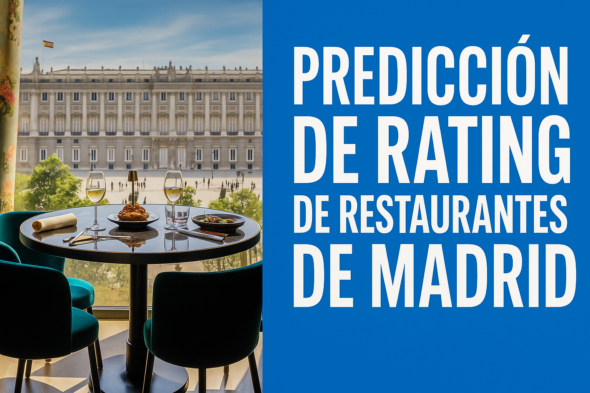

<p align="center">
  
</p>

🧠 **Proyecto Final de Machine Learning: Predicción de Rating de Restaurantes en Madrid**

----------

📌 **Descripción**

Este proyecto tiene como objetivo desarrollar un modelo de Machine Learning, que permita predecir el rating esperado de un restaurante al abrir en Madrid en función de ciertas características clave (ubicación, tipo de comida, precio, etc.).

📚**Fuentes**
- API Google Maps: [Nearbysearch](https://developers.google.com/maps/documentation/places/web-service/search-nearby?hl=es-419) y [Places](https://developers.google.com/maps/documentation/places/web-service?hl=es-419)
- API OpenStreet Maps: [Enlace](https://wiki.openstreetmap.org/wiki/API)
- Panel de indicadores de distritos y barrios de Madrid. Estudio sociodemográfico: [Enlace](https://datos.madrid.es/portal/site/egob/menuitem.c05c1f754a33a9fbe4b2e4b284f1a5a0/?vgnextoid=71359583a773a510VgnVCM2000001f4a900aRCRD&vgnextchannel=374512b9ace9f310VgnVCM100000171f5a0aRCRD&vgnextfmt=default)
- Barrios municipales de Madrid: [Enlace](https://geoportal.madrid.es/IDEAM_WBGEOPORTAL/dataset.iam?id=422fa235-762b-11e9-861d-ecb1d753f6e8)

🛠️ **Tecnologías y Herramientas**
  - Python (Pandas, Scikit-learn, etc.)
  - Jupyter Notebooks
  - Streamlit
  - GitHub
  - Canva / Markdown (para presentaciones y documentación)
  - VS Code

🗂️ **Estructura del Repositorio**
```
│
├── data/                        # Datos utilizados en el proyecto
│   ├── raw/                    # Datos en crudo
│   ├── processed/              # Datos ya procesados
│   ├── train/                  # Datos de entrenamiento
│   └── test/                   # Datos de prueba
│
├── notebooks/                  # Desarrollo exploratorio y modelado
│   ├── 01_Fuentes.ipynb
│   ├── 02_LimpiezaEDA.ipynb
│   └── 03_Entrenamiento_Evaluacion.ipynb
│
├── src/                        # Código fuente del proyecto
│   ├── data_processing.py
│   ├── training.py
│   └── evaluation.py
│
├── models/                     # Modelos entrenados y configuración
│   ├── trained_model.pkl
│   └── model_config.yaml
│
├── app_streamlit/              # Aplicación de despliegue
│   ├── app.py
│   └── requirements.txt
│
├── docs/                       # Documentación del proyecto
│   ├── negocio.ppt             # Presentación orientada al negocio
│   ├── ds.ppt                  # Presentación técnica
│   └── memoria.md              # Memoria escrita del proyecto
│
└── README.md                   # Este archivo
```
📊 **Proceso del Proyecto**
Adquisición de Datos: Se recopilaron datos relevantes de distintas fuentes relacionadas con restaurantes en Madrid.

**Limpieza y EDA:** Se realizó un análisis exploratorio exhaustivo para entender patrones y relaciones.

**Feature Engineering:** Se diseñaron variables útiles para mejorar la capacidad predictiva del modelo.

**Modelado:** Se entrenaron distintos modelos y se optimizaron mediante técnicas de validación cruzada.

**Evaluación:** Se compararon métricas como RMSE y R² para seleccionar el mejor modelo.

**Despliegue:** Se desarrolló una app con Streamlit que permite al usuario introducir características y obtener una predicción del rating.

💡 **Valor de Negocio**
Esta herramienta puede ayudar a emprendedores y cadenas de restauración a tomar decisiones informadas sobre la viabilidad de un nuevo restaurante en Madrid, anticipando su posible aceptación mediante una predicción basada en datos históricos.
